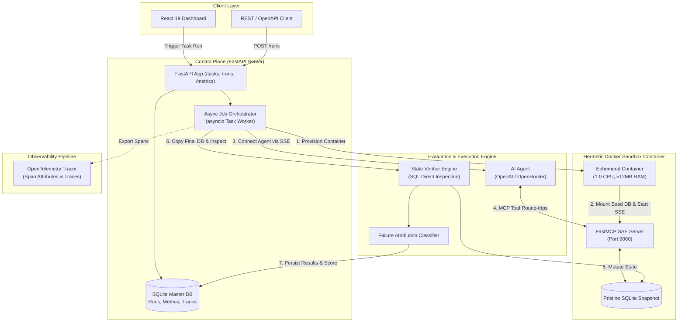

<div align="center">

# ⚡ AgentArena

### **Enterprise-Grade AI Agent Training, Benchmarking & Evaluation Platform**

*Hermetic Docker Isolation • Model Context Protocol (FastMCP) • Deterministic State Verifiers • OpenTelemetry Tracing • Failure Attribution Engine*

[](https://python.org)
[](https://fastapi.tiangolo.com)
[](https://docker.com)
[](https://modelcontextprotocol.io)
[](https://opentelemetry.io)
[](https://react.dev)
[](LICENSE)

---

</div>

## 📌 Executive Summary

**AgentArena** is an isolated, reproducible, enterprise-grade evaluation and benchmarking platform for autonomous AI agents executing multi-step enterprise workflows. 

Traditional LLM evaluation relies on static prompt datasets or "LLM-as-a-judge" grading—approaches that fail when evaluating complex autonomous agents that call tools, mutate system state, and operate over multiple turns.

AgentArena solves this by providing a **production-class agent training environment**:
- 🛡️ **Hermetic Isolation**: Every agent run executes in an ephemeral Docker container spawned from a pristine state snapshot.
- 🔌 **Standardized Tool Transport**: Agents interact with environment capabilities exclusively via Model Context Protocol (**FastMCP** over SSE).
- 🔍 **Ground-Truth Verification**: Evaluates success by programmatically inspecting target database state changes, never trusting agent prose.
- 🏷️ **Root-Cause Failure Attribution**: Automatically triages run failures into **MODEL_FAILURE**, **ENVIRONMENT_FAILURE**, or **TASK_FAILURE**.
- 🔁 **Deterministic Replayability**: Re-executes historical runs under identical starting conditions for regression testing.
- 📊 **End-to-End Telemetry**: Full span tracing powered by **OpenTelemetry** across environment preparation, tool execution, and verification.

---

## 🏗️ Architecture Overview



---

## 🔥 Key Engineering Features

### 1. 🛡️ Hermetic Docker Sandbox Isolation
To prevent side-effects across concurrent runs and eliminate state contamination:
- Each task run provisions an **ephemeral Docker container** (`agentarena-sandbox:latest`).
- Containers run under strict cgroups resource limits (`1.0 vCPU`, `512MB RAM`).
- Enforces hard task-level timeouts (`asyncio.wait_for`).
- Containers are destroyed in an **unconditional `finally` block** regardless of run outcome or process crashes.

### 2. 🔌 Model Context Protocol (FastMCP)
Tools are defined using standard FastMCP schema and exposed over network SSE (`http://localhost:PORT/sse`):
- `search_customers(company, email)`
- `search_tickets(customer_id, status)`
- `search_overdue_invoices(customer_id)`
- `update_ticket(ticket_id, status, priority, assigned_team)`
- `find_tickets_needing_billing()`

### 3. 🎯 Deterministic State Verification & Multi-Tier Scoring
AgentArena never asks an LLM if the agent succeeded. Instead, the verifier engine copies the container's final database snapshot and evaluates true system state changes against expected invariant rules.

**Scoring Breakdown (0.0 to 1.0)**:
- **Functional Correctness (60%)**: Did the agent fulfill the primary task goal?
- **State Correctness (20%)**: Were target records updated with correct field values?
- **Step Economy / Efficiency (20%)**: Did the agent complete the task in minimal tool iterations?

### 4. 🧠 Root-Cause Failure Attribution Classifier
When a run fails, AgentArena pinpoint-attributes the root cause:

| Failure Category | Trigger Criteria |
| :--- | :--- |
| 🔴 **`MODEL_FAILURE`** | Agent made invalid tool calls, misreasoned logic, updated wrong entities, or exceeded iteration limits (`>= 20` steps). |
| 🟡 **`ENVIRONMENT_FAILURE`** | Infrastructure crash, container startup timeout, DB lock contention, or LLM API error (`401`, `402`, `429`). |
| 🔵 **`TASK_FAILURE`** | Task specification contract mismatch or broken verifier assertion. |

### 5. 🔁 Deterministic Run Replayability
Every run logs its exact `container_id`, `env_version`, seeded DB revision, and executed tool call trace. Replaying a run (`POST /runs/replay`) spawns a fresh container from the identical seed version to verify agent consistency and test model prompt changes.

### 6. 📡 OpenTelemetry Tracing
Full span context propagation across the lifecycle:
- `agentarena.task_run`: End-to-end duration, run ID, score, failure category.
- `agentarena.environment_prepare`: Docker container spawn & SSE port binding duration.
- `agentarena.agent_execution`: Tool iteration loop, LLM request latency, tool execution count.
- `agentarena.verifier_eval`: State extraction & verification execution time.

---

## 🎯 Task Benchmark Suite (10 Tasks)

AgentArena includes 10 enterprise operational scenarios designed to test multi-step reasoning, entity joining, and targeted database updates:

| ID | Task Name | Difficulty | Objective Summary |
| :--- | :--- | :---: | :--- |
| `billing_escalation` | Billing Escalation | 🟢 **Easy** | Find open/pending tickets for customers with overdue invoices and assign to Billing. |
| `vip_escalation` | VIP Customer Ticket Escalation | 🟢 **Easy** | Escalate open tickets for high-spend customers (`spend > $10,000`) to `urgent` priority. |
| `ticket_priority_alignment` | Critical Subject Priority Alignment | 🟢 **Easy** | Set priority to `urgent` for all tickets containing `"CRITICAL"` in subject. |
| `stale_ticket_cleanup` | Stale Low Priority Ticket Cleanup | 🟡 **Medium** | Identify and close all open tickets marked with `low` priority. |
| `unassigned_routing` | Unassigned Ticket Routing | 🟡 **Medium** | Route all unassigned tickets to appropriate departmental teams based on content. |
| `duplicate_ticket_close` | Duplicate Ticket Deduplication | 🟡 **Medium** | Detect duplicate open tickets per customer and mark older duplicates as `closed`. |
| `overdue_invoice_reminder` | Overdue Invoice Status Update | 🟡 **Medium** | Update ticket statuses to `pending_payment` for customers with unpaid overdue invoices. |
| `order_refund_escalation` | Refunded Order Escalation | 🔴 **Hard** | Find customers with refunded orders and escalate open tickets to `Tier 3 Support`. |
| `engineering_bug_routing` | Engineering Bug Ticket Routing | 🔴 **Hard** | Route tickets referencing `"API"` or `"Bug"` to the `Engineering` team. |
| `enterprise_account_audit` | Enterprise Account Ticket Audit | 🔴 **Hard** | Identify enterprise customers (`"Corp"`, `"Inc"`) and assign tickets to `Enterprise Account Team` as `urgent`. |

---

## ⚡ Performance & Load Benchmarks

All benchmark metrics recorded on Apple M-series hardware using Docker Desktop sandbox containers:

### Baseline Performance (Single Container Run)
- **Total Elapsed Time**: `27.76s`
- **P50 Execution Latency**: `25.16s`
- **Throughput**: `2.2 tasks/min`
- **Container Cleanup Latency**: `< 400ms`

### Concurrency & Scaling Analysis
When scaling to concurrent container executions (`N=3` on a single host), Docker Desktop CPU contention increases LLM network round-trip time from ~2s to ~6s per tool step. To prevent false timeouts, AgentArena includes a dynamic `timeout_multiplier` configuration for high-concurrency evaluation workloads.

---

## 💻 Tech Stack & Engineering Rationale

| Layer | Technology | Engineering Rationale |
| :--- | :--- | :--- |
| **Language** | Python 3.12 | Modern async features, native type hints, fast execution with `uv`. |
| **Web Framework** | FastAPI + Uvicorn | High-performance asynchronous REST API with OpenAPI auto-docs. |
| **Sandbox Isolation** | Docker + Alpine Linux | Lightweight, reproducible container environments with cgroup hardware limits. |
| **Agent Protocol** | FastMCP (Model Context Protocol) | Industry-standard protocol for LLM tool discovery and execution over SSE. |
| **Database** | SQLite + SQLAlchemy 2.0 | Zero-config, single-file database copy per sandbox container for isolation. |
| **Observability** | OpenTelemetry SDK | Vendor-neutral distributed tracing for span metrics and performance profiling. |
| **Frontend UI** | React 19 + Vite + TailwindCSS | Sleek, modern telemetry dashboard featuring live run status and execution traces. |

---

## 🚀 Quick Start Guide

### Prerequisites
- **Python 3.12+**
- **`uv` Package Manager** (`curl -LsSf https://astral.sh/uv/install.sh | sh`)
- **Docker Desktop** (running)
- **Node.js 18+ & pnpm / npm** (for frontend UI)

### 1. Clone & Install Backend Dependencies
```bash
git clone https://github.com/himanshukandari14/agent-forge.git
cd agent-forge
uv sync
```

### 2. Build the Hermetic Docker Sandbox Image
```bash
docker build -f Dockerfile.sandbox -t agentarena-sandbox:latest .
```
> *This bakes the seeded SQLite database snapshot into the container image (~2 minutes on first build).*

### 3. Configure API Credentials
```bash
cp .env.example .env
```
Edit `.env` to supply your LLM credentials:
```env
OPENAI_API_KEY="sk-proj-..."
MODEL_NAME="gpt-4o-mini"
MAX_TOKENS=1000
```

### 4. Launch Backend API Server
```bash
uv run uvicorn app.main:app --reload --port 8000
```
*API server will start on [http://localhost:8000](http://localhost:8000).*

### 5. Launch Frontend Telemetry Dashboard
In a separate terminal window:
```bash
cd frontend
pnpm install
pnpm dev
```
*Dashboard will open on [http://localhost:5173](http://localhost:5173).*

---

## 📡 REST API Reference

### 1. List Available Task Benchmark Definitions
```bash
curl -X GET http://localhost:8000/tasks
```

### 2. Trigger Asynchronous Task Run
```bash
curl -X POST http://localhost:8000/runs \
     -H "Content-Type: application/json" \
     -d '{"task_id": "billing_escalation"}'
```
**Response**:
```json
{
  "run_id": "run_a70cab8b",
  "status": "queued",
  "task_id": "billing_escalation"
}
```

### 3. Fetch Run Results & Tool Call Traces
```bash
curl -X GET http://localhost:8000/runs/run_a70cab8b
```
**Response**:
```json
{
  "id": "run_a70cab8b",
  "task_id": "billing_escalation",
  "status": "passed",
  "score": 1.0,
  "failure_category": "NONE",
  "duration_seconds": 6.57,
  "container_id": "73e21c07403a",
  "tool_calls": [
    {
      "step": 1,
      "tool_name": "find_tickets_needing_billing",
      "arguments": "{}",
      "success": true
    }
  ]
}
```

### 4. Replay Historical Run
```bash
curl -X POST http://localhost:8000/runs/replay \
     -H "Content-Type: application/json" \
     -d '{"run_id": "run_a70cab8b"}'
```

---

## 🧪 Running Unit Tests & Load Tests

### Run Automated Unit Test Suite (20 Tests)
```bash
uv run pytest -v
```

### Run Multi-Container Load Benchmark
```bash
uv run python scripts/load_test.py 3
```

---

## 🌟 Why This Project Matters (Engineering Spotlight)

AgentArena demonstrates the complex engineering patterns required to build infrastructure for autonomous AI agents:
1. **Infrastructure as Code for AI**: Automated lifecycle management of sandboxed environments.
2. **Protocol Conformance**: Implementing open protocols (MCP) for tool interaction rather than ad-hoc wrappers.
3. **Robust Systems Engineering**: Idempotent execution, timeout enforcement, cleanup guarantees, and telemetry.
4. **Data-Driven Evaluation**: Moving away from subjective prompt grading to rigorous, state-verified metrics.

---

## 📜 License

Distributed under the MIT License. See [`LICENSE`](LICENSE) for details.
